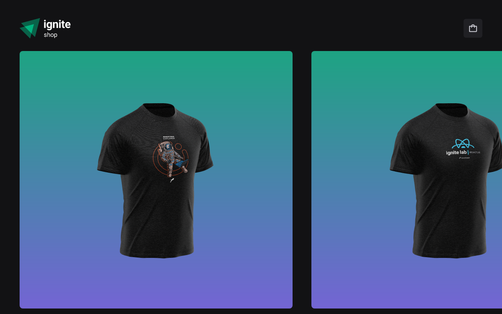

# Ignite Shop

## 💻 Projeto

Desafio da criação de uma loja de roupa fictício, feito na trilha de ReactJs to Ignite da Rocketseat

## ✨ Tecnologias

Este projeto foi desenvolvido com as seguintes tecnologias:

- [React](https://react.dev/)
- [Next](https://nextjs.org/)
- [Stitches](https://stitches.dev/)
- [Stripe](https://stripe.com/br)
- [TypeScript](https://www.typescriptlang.org/)

## 🚀 Como executar o projeto.

- Clone o repositório
- Rode `yarn` para baixar as dependências
- Rode o `yarn dev` para iniciar a aplicação.